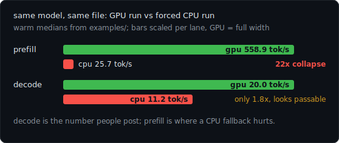
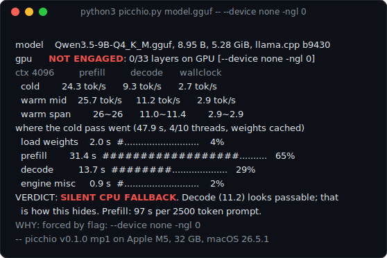

<div align="center">


<h1>picchio</h1>

<p>One Python file that measures local LLMs: effective bits per weight, the three tok/s lanes, and silent CPU fallback.</p>

<p>
<a href="https://github.com/logxio/picchio/actions/workflows/selftest.yml"></a>
<a href="LICENSE"></a>

</p>

<p><a href="#install">Install</a> · <a href="#commands">Commands</a> · <a href="#the-quant-label">Quant</a> · <a href="#three-lanes">Lanes</a> · <a href="#measured">Measured</a> · <a href="examples/">Examples</a></p>


</div>

Most GPU speed claims are one tok/s number. That number can be
correct and still tell you the wrong story. Three failure modes,
each one command:

- Four quantizations of the same Qwen3.5-9B, all labeled Q4_K_M,
  measure 5.02, 5.02, 5.07 and 5.27 bits per weight
  ([the quant label](#the-quant-label)).
- Losing the GPU cost prefill 22x and decode under 2x on the same
  model and file ([three lanes](#three-lanes)).
- The 36 tok/s I remembered from bare llama.cpp reproduced in no
  cell of a 32 cell matrix ([silent CPU fallback](#silent-cpu-fallback)).

picchio splits prefill, decode and wallclock, reads the engine's
log against the OS's GPU meter, and prints a verdict that says
whether the GPU did the work, and why.

## Install

```
curl -fsSLO https://raw.githubusercontent.com/logxio/picchio/main/picchio.py
python3 picchio.py
```

With no arguments it finds your models (ollama tags, the current
folder, the HF and LM Studio caches) and runs the one you pick. A
.gguf path gets the full llama.cpp diagnosis; an ollama tag gets
measurement mode.

Needs python3 and either llama.cpp or ollama. Three passes with a
fixed prompt, the first one cold.
About a minute here with the GPU engaged, a few minutes on CPU. It
writes one cache file under `~/.cache/picchio` and nothing else.

`python3 picchio.py --selftest` replays the raw engine logs in
[examples/raw/](examples/raw/) and must reproduce every committed
verdict block line for line; the badge runs it on every push.

## Commands

In the table, `picchio` stands for `python3 picchio.py`.

| command | what it does | real output |
|---------|--------------|-------------|
| `picchio model.gguf` | full llama.cpp diagnosis: three passes, placement, cold start breakdown, verdict | [example](examples/healthy-metal.txt) |
| `picchio qwen3.5:9b` | same passes through your local ollama server, placement from the memory split it reports | [example](examples/ollama-qwen35.txt) |
| `picchio http://127.0.0.1:8080` | measures a llama-server already running, nothing launched, warm rows only | [example](examples/server-endpoint.txt) |
| `picchio guard -- <command>` | wraps your own command, warns the moment layers land off the GPU, never kills it | [example](examples/guard-ngl0.txt) |
| `picchio compare A.txt B.txt` | diffs two saved blocks variable by variable, the first config difference takes the blame | [example](examples/compare.txt) |
| `picchio verify FILE` | flags a pasted block whose own numbers contradict each other | [example](examples/verify-forged.txt) |
| `picchio watch [PID]` | points the OS GPU meter at a process or the whole GPU, no engine log parsing (macOS) | [example](examples/watch-ollama.txt) |
| `picchio plan [MODEL]` | will it fit, priced from the gguf header; a decode estimate appears once one run is measured | [example](examples/plan-35b.txt) |
| `picchio id MODEL` | splits the quant label: per tensor type mix, effective bits per weight, KV dtype, experts | [example](examples/id-35b.txt) |
| `picchio --explain 36` | classifies a number you saw against the lanes measured here (cached rates, no rerun) | [example](examples/explain-36.txt) |
| `picchio model.gguf --ctx-sweep` | re-measures the lanes at several context depths and reports the decay slope | [example](examples/ctx-sweep.txt) |

`watch` runs next to real work, launching nothing and unloading
nothing; `--for` is the sampling window in seconds, `--engine
ollama` names the model being judged:

```
python3 picchio.py watch --engine ollama --for 8
```

```
--passes N       measurement passes, first one cold (default 3)
--keep-logs DIR  save each pass's raw engine output into DIR, plus
                 the sampled GPU curve (telemetry.json) on macOS
                 and on NVIDIA Linux
--no-telemetry   skip the OS-side GPU sampling; the os line then
                 says the verdict rests on engine+timing only
--json           machine readable measurements after the block
--bin PATH       choose the llama.cpp binary yourself
--selftest       replay examples/raw, verify committed verdicts reproduce
--version        print version and measurement protocol
```

Anything after a bare `--` goes straight to the llama.cpp binary.
Color only on a terminal (`NO_COLOR` respected); piped output is
plain ASCII.

Exit codes, for scripting: 0 healthy or no evidence, 2 could not
run, 3 partial offload, 4 silent CPU fallback, 5 conflicting
evidence. guard passes the wrapped command's own exit code through
(128 plus the signal number if it died by one); compare exits 0
once both blocks parse; verify exits 0 when a block is
self-consistent, 5 when its sources fight; watch exits 0 when the
GPU is working, 4 when it sits idle.

## The quant label

`picchio id MODEL` walks the gguf tensor table and prices every
tensor by its ggml type. Our own Q4_K_M measures 5.07 bits per
weight, a mix of five tensor types from 4.50 to 32.00 bits, and
the header's own byte offsets have to audit to the same total
before the card prints. The same Qwen3.5-9B under the same Q4_K_M
label measures 5.02, 5.02, 5.07 and 5.27 bits per weight across
four quantizers, on the 427 tensors all four files share
([examples/quantizers/](examples/quantizers/)). The KV cache dtype is not in the file; the card cites
the last run measured here. On a mixture of experts it reports how
many experts wake per token
([examples/id-35b.txt](examples/id-35b.txt) reads 8 of 256, about
3.5B of 34.7B weights per token). Works on a .gguf path or
an ollama tag, read only, exit 0.

## Three lanes

Prefill (elsewhere called prompt processing or pp) is
how fast the model reads your prompt; decode (tg or eval) is how
fast it writes the answer; wallclock is generated tokens divided by
everything, load and warmup included.

<p align="center">

</p>

The lanes fail separately; the chart is two real runs from
[examples/](examples/), 4 of 10 cpu threads on the CPU side.
Prefill sets the time to first token on a long prompt. A Mac
screenshot showing 500 tok/s is almost always prefill.

## Silent CPU fallback

Same machine, same model, same file, forced to CPU
([examples/cpu-fallback.txt](examples/cpu-fallback.txt)):

<p align="center">

</p>

The WHY line names the first cause the run's own evidence can
prove, or says unknown.

While measuring local models for an app I am building, weeks of
it, bare llama.cpp gave me 36 tok/s and the same model through the
app gave 11.5: that gap is why this repo exists. A 32 cell matrix
across CPU and GPU, cold and warm, reproduced the 36 in no cell, a
rate from a different lane remembered as generation speed. What
the matrix did surface was this silent fallback.

## The os line

While the passes run, a background thread reads the OS's own GPU
meter: on macOS, `ioreg` at 4 Hz plus the `powermetrics` energy
counters, minus the sudo; on NVIDIA Linux, the driver's NVML. That
is the `os` line. A full offload claim over a GPU the OS saw stay
flat is CONFLICTING EVIDENCE (exit 5). A build that prints no gpu
evidence while the meter watches the gpu stay idle is SILENT CPU
FALLBACK (exit 4), measured on a real mis-built binary. A missing
source abstains; the line says which evidence is left.

## llama-bench

llama-bench answers a different question. Steady state pp and tg
for this machine and model, measured here, same model, same day:

| tool, config              | prompt side   | generation side | notes                     |
|---------------------------|---------------|-----------------|---------------------------|
| llama-bench, default      | pp256: 597.06 | tg64: 20.21     | backend column: BLAS,MTL  |
| llama-bench, -ngl 0 (CPU) | pp256: 27.82  | tg64: 11.90     | backend column: BLAS,MTL  |

The rented 4090 does the same. Its CUDA build keeps `CUDA` in that
column at `-ngl 0`. The 21x prompt side collapse is the CPU run's
only visible trace; there is no load time, no cold/warm split, no
verdict.

## Measured

Apple M5, 32 GB, macOS 26.5.1, llama.cpp build 9430 and ollama
0.31.1, roughly 730 prompt tokens and 128 generated tokens per pass,
three passes, the first one cold. That protocol is named in every
block footer (mp1); if it ever changes the tag changes. The lane
columns hold warm medians; the raw engine output behind the first
three rows and the 4090 row is in [examples/raw/](examples/raw/),
written by `--keep-logs`.

| machine         | model, engine                      | protocol | prefill | decode | wallclock | verdict             |
|-----------------|------------------------------------|----------|--------:|-------:|----------:|---------------------|
| Apple M5, 32 GB | Qwen3.5-9B Q4_K_M, llama.cpp b9430 | mp1      |   588.0 |   21.1 |      15.5 | HEALTHY             |
| Apple M5, 32 GB | same, forced CPU (0/33 layers)     | mp1      |    26.8 |   12.2 |       3.0 | SILENT CPU FALLBACK |
| Apple M5, 32 GB | qwen3.5:9b, ollama 0.31.1          | mp1      |   833.8 |   21.3 |      18.1 | HEALTHY             |
| Apple M5, 32 GB | Qwen3.6-35B-A3B UD-Q4, llama.cpp   | mp1      |   787.3 |   34.4 |      19.1 | HEALTHY             |
| Apple M5, 32 GB | qwen3.6:35b-a3b, ollama 0.31.1     | mp1      |  1191.8 |   33.4 |      27.6 | HEALTHY             |
| RTX 4090, Linux | Qwen3.5-9B Q4_K_M, llama.cpp b9430 | mp1      |  6763.3 |  138.0 |      25.2 | HEALTHY             |
| your machine    |                                    |          |         |        |           |                     |

Run picchio once and paste the verdict block into an issue; a
boring HEALTHY on hardware I do not have is still a data point. A
wrong verdict is the issue I want most.
[Misdiagnosis reports](.github/ISSUE_TEMPLATE/misdiagnosis-report.md)
go to the top of the pile.

The 35B result is mostly a load-time problem. 13 of the first
pass's 19 seconds went to reading 20.6 GiB of weights. The
3B-active MoE still decodes 1.6x faster than the dense 9B.

## Limits

- Tested: one Apple Silicon machine (llama.cpp and ollama) plus
  one rented Linux RTX 4090 (CUDA). ollama on Linux and Vulkan
  parsing have not touched real hardware; if you run those, I want
  the verdict block either way.
- The full verdict block is llama.cpp and ollama only. MLX, LM
  Studio and other engines get placement truth through `watch`,
  not the lane table.
- Ollama does not expose per layer placement, device init logs, or
  thread configuration. Placement comes from the memory split it
  reports, unknown when there is none.
- Server mode forces a full prompt read on every pass; on a remote
  url, wallclock includes the network round trip.
- Warm numbers drift between sessions: the 9B medians in this repo
  moved 5 to 8% between two recording rounds on an idle machine.
  `--passes 5` tightens a single reading.
- The os meter counts the whole GPU (index 0 on Linux), so it only
  judges runs that started from an idle GPU.

## License

[MIT](LICENSE).
