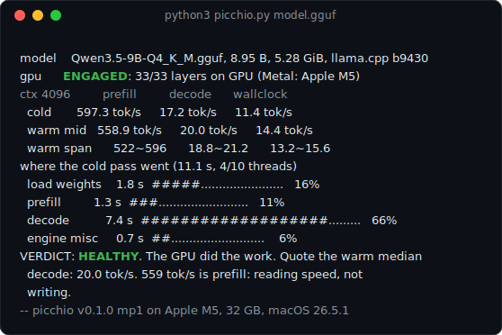

<div align="center">


<h1>picchio</h1>

<p>Picchio is Italian for woodpecker: one Python file that knocks on
your local LLM setup and listens for hollow spots. Which tok/s did
you actually get, and did the GPU really do the work?</p>

<p>
<a href="https://github.com/logxio/picchio/actions/workflows/selftest.yml"></a>
<a href="LICENSE"></a>

</p>

<p><a href="#get-it-running">Install</a> · <a href="#the-three-numbers">What it checks</a> · <a href="#why-is-your-number-different-from-mine">Compare</a> · <a href="#guard-mode-watch-your-own-command">Guard</a> · <a href="examples/">Examples</a></p>



</div>

That block is the whole product: three lanes never merged into one
number, placement evidence from the engine's own logs, the OS
meter's independent reading, a cold pass breakdown, and a verdict,
in 15 lines kept narrow enough to survive a comment thread. Real
output, unedited ([examples/healthy-metal.txt](examples/healthy-metal.txt));
the text version below is the one you paste:

```
model    Qwen3.5-9B-Q4_K_M.gguf, 8.95 B, 5.28 GiB, llama.cpp b9430
gpu      ENGAGED: 33/33 layers on GPU (Metal: Apple M5)
os       gpu idle 0%, work 99%, mem +6.0 GiB, 11.0 W
ctx 4096         prefill         decode      wallclock
  cold       584.9 tok/s     21.0 tok/s     13.1 tok/s
  warm mid   588.0 tok/s     21.1 tok/s     15.5 tok/s
  warm span      585~591      21.0~21.2      15.4~15.5
where the cold pass went (9.7 s, 4/10 threads)
  load weights    1.8 s  #####.......................   18%
  prefill         1.3 s  ####........................   13%
  decode          6.1 s  #################...........   62%
  engine misc     0.6 s  ##..........................    6%
VERDICT: HEALTHY. The GPU did the work. Quote the warm median
  decode: 21.1 tok/s.
-- picchio v0.1.0 mp1 on Apple M5, 32 GB, macOS 26.5.1
```

## Get it running

```
curl -LO https://raw.githubusercontent.com/logxio/picchio/main/picchio.py
python3 picchio.py
```

That second line, with no arguments, looks around your machine
(ollama tags, the current folder, the HF and LM Studio caches). One
model found, it runs it; several, it lists them and you pick by
number, path, or tag; none, it asks for a path. It asks once, then
runs to the block below without stopping. Piped or redirected, it
prints the commands instead. Or point it at a model yourself:
a .gguf path (`python3 picchio.py /path/to/model.gguf`) gets the
full llama.cpp diagnosis, an ollama tag (`python3 picchio.py
qwen3.5:9b`) gets measurement mode.

No pip, no dependencies, no config. One Python file, 2655 lines,
stdlib only; python3 plus either llama.cpp or ollama is everything
it needs. It runs your model three times with a fixed prompt (the
first pass cold, the rest warm), reads the engine's own numbers
while a background thread reads the OS's GPU meter, and prints the
block above. A run costs about a minute here with the GPU engaged,
a few minutes on CPU; it writes one small cache file under
`~/.cache/picchio`, modifies nothing, and leaves no process behind.

When to rerun it: after a llama.cpp or ollama upgrade, after an OS
update, after switching quants of the same model, after touching -ngl
or context size, and once before you post a tok/s number anywhere.

The parser is pinned by the raw logs in this repo:
`python3 picchio.py --selftest` replays the unedited engine output
in [examples/raw/](examples/raw/) and must reproduce every committed
verdict block line for line (9 pass fixtures, 3 blocks, 4 compare
checks, 5 synthetic telemetry timelines, 4 verify checks, 3 watch
checks, 2 context-sweep checks, 6 onboarding checks); the badge runs
it on every push.

## The three numbers

Every tok/s figure belongs to one of three lanes, and picchio never
merges them. Prefill is how fast the model reads your prompt; decode
is how fast it writes the answer; wallclock is generated tokens
divided by everything, load and warmup included, which is what your
stopwatch and your gut measure. In the block above the warm medians
land at 588, 21.1 and 15.5; on the CPU run below they land at 27, 12
and 3. A single unlabeled number spanning that spread is not a
measurement, it is a rumor.

<p align="center">

</p>

The lanes fail separately. Measured here, the GPU buys about 22x on
prefill and under 2x on decode (both runs are in
[examples/](examples/), 4 of 10 cpu threads on the CPU side). Nearly
every figure posted online is decode, because decode feels like
typing speed, but most of the pain on consumer hardware lives in
prefill, which decides how long a long prompt sits silent before the
first word: a Mac screenshot showing 500 tok/s is almost always
prefill, and two setups can post the same decode number while one
takes ten times longer to start answering.

## The hollow spot: silent CPU fallback

Same machine, same model, same file, forced to CPU
([examples/cpu-fallback.txt](examples/cpu-fallback.txt)):

<p align="center">

</p>

The text version:

```
model    Qwen3.5-9B-Q4_K_M.gguf, 8.95 B, 5.28 GiB, llama.cpp b9430
gpu      NOT ENGAGED: 0/33 layers on GPU [--device none -ngl 0]
os       gpu idle 8%, work 5%, mem +0.3 GiB, 0.1 W
ctx 4096         prefill         decode      wallclock
  cold        22.8 tok/s      9.3 tok/s      2.5 tok/s
  warm mid    26.8 tok/s     12.2 tok/s      3.0 tok/s
  warm span        27~27      12.0~12.4        3.0~3.0
where the cold pass went (49.9 s, 4/10 threads, weights cached)
  load weights    2.1 s  #...........................    4%
  prefill        33.4 s  ###################.........   67%
  decode         13.7 s  ########....................   27%
  engine misc     0.8 s  ............................    2%
VERDICT: SILENT CPU FALLBACK. Prefill: 93 s per 2500 tokens.
WHY: forced by flag: --device none -ngl 0
-- picchio v0.1.0 mp1 on Apple M5, 32 GB, macOS 26.5.1
```

Look at what moved and what did not: decode barely dropped, but
prefill fell 22x, so the first word of a long prompt now takes a
minute and a half. picchio calls this from three directions: the
placement log (0/33 offloaded), the prefill signature, and the os
line that watched the GPU sleep through the whole run. The forcing
flags ride the gpu line, so the block carries its own reproduction
recipe.

The WHY line on a degraded verdict is attribution, not a guess. It
names the first cause it can prove from this run's own evidence: an
explicit flag on the command line, the engine's memory fit figures
(the MiB it saw free and the layers it granted), or a backend init
failure line quoted as logged. When none of those are in the log, it
says unknown, out loud, rather than inventing a reason.

## The engine does not have to confess

Both verdicts above lean on a witness the engine does not control,
because engine logs have been wrong before: ollama has shipped
releases that reported a full GPU load while the kernels ran
elsewhere. So while the passes run on macOS, a background thread
reads the OS's own GPU accounting (`ioreg`, utilization and memory,
4 Hz) and GPU power from the same energy counters `powermetrics`
reports, minus the sudo: the `os` line, under the engine's claim.

Read the two lines against each other in the healthy block: the
engine says 33/33 on GPU; the OS says that GPU sat idle before the
run, ran at a median 99% exactly while the tokens were made, and
stepped its memory up as the weights landed. The engine could have
written anything; the meter was watching either way.

A verdict is a three way agreement: the engine's confession, the OS
meter, and the prefill/decode speed signature each get a vote, and a
full offload claim earns HEALTHY only while no source contradicts
it. An engine claiming full offload over a GPU the OS watched stay
flat gets CONFLICTING EVIDENCE (exit 5), the two claims printed one
above the other; here the two sides sit at a median 99% against 5%,
so the fight is not subtle.

The line never degrades silently. Off macOS, with `--no-telemetry`,
or when ioreg gives nothing back, it reads `gpu not sampled
(reason); evidence: engine+timing`. On a GPU that was already busy
before the run it reads `not idle; not judged`: the meter counts the
whole GPU, and someone else's workload cannot convict or clear your
engine. A missing source abstains; only a present, contradicting one
can flip a verdict. Thermal pressure adds `throttled` to the line;
power and thermal state are printed for the record and never vote.

## The number you saw somewhere

The third thing picchio does is interrogate a number you saw
somewhere, or half remember:

```
$ python3 picchio.py --explain 36
YOUR NUMBER: 36.0 tok/s -> MATCHES NOTHING MEASURED HERE
  36.0 tok/s is not within 30% of anything measured here
  (closest: decode, off by 1.7x; measured: prefill 588.0, decode
  21.1, wallclock 15.5 tok/s). Before trusting that number, ask
  which of the three rates it was, and on what hardware, quant,
  and context length.
(rates: Qwen3.5-9B-Q4_K_M.gguf, Apple M5, 32 GB, 2026-07-11)
```

That 36 is the exact number this repo exists because of (the story
is in "Why I wrote this" below), asked against the machine it
supposedly came from. The check reads the rates cached at your last
diagnostic run, so it needs no rerun; with a model path, `--explain`
appends the same section under a full verdict block instead.

## Why is your number different from mine

Two people run the same model and post different numbers; the
argument that follows is usually two configurations talking past
each other. Save both blocks to files (surrounding forum text is
fine) and let picchio have the argument. Comparing the two above:

```
$ python3 picchio.py compare mine.txt theirs.txt
picchio compare
A: examples/healthy-metal.txt
B: examples/cpu-fallback.txt

           A                         B
model      Qwen3.5-9B-Q4_K_M.gguf    same
quant      Q4_K_M                    same
engine     llama.cpp b9430           same
place      33/33 layers on GPU       0/33 layers on GPU
args       none                      --device none -ngl 0
ctx        4096                      same
threads    4/10                      same
machine    Apple M5, 32 GB           same
os         macOS 26.5.1              same

rates (warm mid), tok/s:
  prefill         588.0        26.8   A 21.9x faster
  decode           21.1        12.2   A 1.7x faster
  wallclock        15.5         3.0   A 5.2x faster

SUSPECT: placement. A ran 33/33 layers on GPU, B ran 0/33 layers
  on GPU. Fix that first; nothing else gets blamed while the first
  rung differs.
```

The suspect comes from a fixed ladder, not a guess: placement first,
then quantization, then a context size an order of magnitude apart,
then hardware. The first rung that differs takes the blame and the
climb stops; when every variable both blocks carry agrees, picchio
says so and names what a block cannot see (background load,
thermals, disk cache) instead of inventing a culprit, and two
identical blocks get "nothing to compare".

This is what the block's configuration fingerprint is for: the ctx
figure by the lane headers and any passthrough engine args on the
gpu line (`[--device none -ngl 0]` above), plus the model, quant,
build, placement, threads and hardware already carried. Blocks from
older picchio versions miss the two fields; compare says unknown.

## Ollama mode

Give picchio an ollama model tag instead of a file path and it runs
the same passes through your local ollama server (default
`127.0.0.1:11434`, or set `OLLAMA_HOST`): same three lanes, same
cold pass breakdown, plus a placement check from the memory split
ollama itself reports. Real run, same weights imported into ollama
([examples/ollama-qwen35.txt](examples/ollama-qwen35.txt)):

```
model    qwen3.5:9b, 9.0 B, Q4_K_M, 5.55 GiB, ollama 0.31.1
gpu      ENGAGED: 100% of weights in GPU memory (ollama ps)
os       gpu idle 2%, work 98%, mem +5.6 GiB, 11.4 W
ctx 4096         prefill         decode      wallclock
  cold       525.0 tok/s     21.2 tok/s     12.8 tok/s
  warm mid   833.8 tok/s     21.3 tok/s     18.1 tok/s
  warm span      829~838      21.2~21.4      18.0~18.2
where the cold pass went (10.0 s)
  load weights    2.5 s  #######.....................   25%
  prefill         1.5 s  ####........................   15%
  decode          6.0 s  #################...........   60%
  engine misc     0.0 s  ............................    0%
VERDICT: HEALTHY. Ollama reports 100% of weights in GPU memory.
  Quote the warm median decode: 21.3 tok/s.
-- picchio v0.1.0 mp1 on Apple M5, 32 GB, macOS 26.5.1
```

Be aware of what this mode cannot see, because ollama does not
expose it: per layer placement, device init logs, thread
configuration. llama.cpp mode is the full diagnosis; ollama mode is
measurement plus a placement check, and with no memory split at all
the placement reads unknown. The three way judgment applies here
unchanged, the os line sampled from outside the server process: a
full GPU claim over a GPU that never woke up, or a CPU shaped
prefill to decode ratio, downgrades to CONFLICTING EVIDENCE.

Measurement over llama.cpp or ollama, compare, and the guard mode
below: that is the whole scope, and picchio stays one readable file.

## Guard mode: watch your own command

The verdict block needs picchio to own the run: its prompt, its
passes. Guard mode is the inverse: your command, your flags, your
server. picchio spawns it, streams its stderr through untouched,
never kills or signals it, and speaks only when it knows where the
model landed: one warning line into the stream the moment the log
shows layers landing off the GPU, with the same WHY attribution the
verdict block carries, and a short placement summary when your
command exits. Real run, engine output elided down to picchio's own
lines (the full stream passes through unchanged):

```
$ python3 picchio.py guard -- llama-completion \
    -m /tmp/models/Qwen3.5-9B-Q4_K_M.gguf \
    -p "Say hi." -n 16 --verbose -ngl 0
[1370 lines of the engine's own stderr stream through]
picchio guard: NOT ENGAGED: 0/33 layers on GPU (Metal: Apple M5); WHY: forced by flag: -ngl 0
[472 more engine lines; the run finishes on its own]
picchio guard: llama-completion exited 0 after 8.6 s
picchio guard: NOT ENGAGED: 0/33 layers on GPU (Metal: Apple M5); WHY: forced by flag: -ngl 0
picchio guard: last rates seen: prefill 8.5 tok/s, decode 10.4 tok/s
```

A healthy load gets the same placement line, just ENGAGED with no
WHY. Guard exits with the wrapped command's own exit code (128 plus
the signal number if it died by one): the warning lives on stderr,
so wrapping a server changes nothing your scripts depend on.

One caveat, measured on this build (b9430): llama.cpp's default log
level does not print placement lines, so give your command
`--verbose` (`-lv 4` is enough on llama-server); when no placement
evidence ever appears, the exit summary says so instead of judging.

## Verify: catch a faked verdict

A verdict block is a claim about physics, and physics leaves
fingerprints. `picchio verify` reads a pasted block back and re-derives
those fingerprints from the block's own numbers: placement, the
prefill/decode ratio, the OS meter and the headline each say whether
the GPU did the work, and an honest block has all of them describing
the same run. It cannot prove a block is real (numbers can be faked so
they agree), but it catches a block that contradicts itself, which is
what editing one number to look better almost always does.

Take a real CPU-fallback block and flip one line, the placement, to
claim the full GPU:

```
$ python3 picchio.py verify forged.txt
picchio verify: forged.txt
  model     Qwen3.5-9B-Q4_K_M.gguf
  claim     ENGAGED (full gpu), headline HEALTHY
  signature prefill 26.8 = 2.2x decode 12.2, wallclock 3.0
  os        gpu idle 8%, work 5%, mem +0.3 GiB, 0.1 W
VERDICT: FLAG. 2 physical contradictions in this block:
  - claims full gpu but prefill is only 2.2x decode, a cpu shaped
    ratio (a real gpu run is 20x+)
  - claims full gpu but its own os line saw the gpu at 5% while
    the tokens were made
This block contradicts itself; do not trust its numbers as one run.
```

One edit, and the block's own numbers now disagree with themselves:
two independent witnesses, the speed signature and the OS meter,
caught it. A genuine block passes; `verify` exits 0 when the sources
agree, 5 when they fight, the same code a live run gets for
conflicting evidence, and reads a file or stdin so it drops straight
into a paste-review habit.

## Watch: any engine, no log parsing

The verdict block reads placement from llama.cpp's or ollama's own
output. `picchio watch` does it without reading anyone's output at all:
it points the macOS GPU meter at a running process, or the whole GPU,
and reports whether the silicon is actually working. That makes it
engine agnostic. MLX, LM Studio, vLLM, a raw PyTorch script, anything
that generates can be watched.

```
$ python3 picchio.py watch --engine ollama --for 8
picchio watch: ollama model qwen3.5:9b
  window   8.1 s, 33 samples at 4 Hz  (whole gpu)
  gpu      work 98% median, peak 98%, 10.6 W
  memory   7.2 GiB in use by the gpu
GPU BUSY: something is running kernels on the gpu (work 98%
  median, peak 98%, 10.6 W). ioreg meters the whole gpu, so this
  is machine level, not pinned to ollama model qwen3.5:9b.
```

Give it a PID (`picchio watch 12345`) to bound the window to that
process, or nothing to snapshot the whole GPU. A GPU idle while you
know something is generating is the answer, it is on the CPU, and
watch exits 4 to say so.

## The number decays with context

Almost every tok/s number you see was measured at a short context and
quoted as if it held at any length. It does not: each token decode
generates attends to the whole KV cache, so decode slows as the context
fills. `--ctx-sweep` re-measures the three lanes at several context
depths, each fed a prompt long enough to actually reach that depth (a
short prompt at `-c 32768` fills nothing and would just measure the 4k
number three times), and reports the slope. Measured here, Qwen3.5-9B
Q4_K_M on Metal:

```
$ python3 picchio.py /tmp/models/Qwen3.5-9B-Q4_K_M.gguf --ctx-sweep --passes 2
ctx sweep  Qwen3.5-9B-Q4_K_M.gguf, llama.cpp b9430
depth   ctx         prefill        decode     wallclock
  2531  4096    559.9 tok/s    20.0 tok/s    10.4 tok/s
 10439  16384   434.4 tok/s    18.7 tok/s     4.0 tok/s
 21079  32768   393.4 tok/s    17.9 tok/s     2.1 tok/s
SLOPE: decode fell 11% from 2531 to 21079 tokens (8x deeper): 20.0
  -> 17.9 tok/s. Long context is not free; the kv cache taxes
  every token you generate.
```

Prefill fell 30% too, its attention cost growing with the prompt, and
the depth column is the token count the engine actually reached, not
the `-c` ceiling. Whether your own curve is flat or steep, that is the
point: a number no forum post carries, and now you can measure it
instead of guessing.

## Options

```
picchio MODEL [flags] [-- engine args]
picchio guard [--keep-logs DIR] -- <command...>
picchio compare A.txt B.txt
picchio verify [FILE]
picchio watch [PID] [--engine ollama] [--for SEC]

MODEL            a .gguf path (llama.cpp) or an ollama model tag;
                 with no arguments, finds your models and asks
                 which to run (prints commands when not a terminal)
guard            wrap your own llama.cpp command: warn on degraded
                 placement, never kill it, summarize when it exits
compare          diff two saved verdict blocks variable by variable,
                 blame the first config difference on the ladder
verify           re-derive a pasted block's own physics and flag it
                 when its sources contradict each other
watch            point the OS GPU meter at a process or the whole GPU
                 and report placement, no engine log parsing (macOS)
--passes N       measurement passes, first one cold (default 3)
--ctx-sweep LIST re-measure the lanes at each context depth in LIST
                 (default 4096,16384,32768) and report the decay slope
--explain TOKS   classify a number you saw against the measured lanes
--keep-logs DIR  save each pass's raw engine output into DIR, plus
                 the sampled GPU curve (telemetry.json) on macOS
--no-telemetry   skip the OS-side GPU sampling; the os line then
                 says the verdict rests on engine+timing only
--json           machine readable measurements after the block
--bin PATH       choose the llama.cpp binary yourself
--selftest       replay examples/raw, verify committed verdicts reproduce
--version        print version and measurement protocol
```

Anything after a bare `--` goes straight to the llama.cpp binary.
Color appears only on a terminal (`NO_COLOR` is respected); piped
output stays plain ASCII, byte for byte what the selftest verifies.

## Why I wrote this

I had been systematically measuring local models for an app I am
building, weeks of it, when I nearly filed a bug against my own code.
Bare llama.cpp gave me 36 tok/s. The same model through the app gave
11.5. Same machine, same day, and 3x is the kind of number you
reorganize a week around.

Before writing the fix I reran both sides properly: same binary,
same parameters, a 32 cell matrix across CPU and GPU, cold and warm.
The 36 never reproduced. Not in one cell. The slowdown I was about
to hunt did not exist. The number I had trusted was a rate from a
different lane, remembered as generation speed; I never wrote down
which lane it came from, so it meant whatever my theory needed.

What the matrix did surface was a real problem somewhere else. On
some runs the engine put every layer on the CPU without saying
anything at the level you normally look at. Generation speed barely
moved, which is what makes this failure mode invisible; time to
first token on a long prompt is what explodes, about 5 seconds on
the GPU becoming about 50 on the CPU for a 2.5k token prompt.

So there was no 3x slowdown, there was a silent GPU problem, and my
own note was the bug that hid one behind the other. picchio is that
week of debugging folded into one file you can run in a minute.

## Is this not just llama-bench?

llama-bench is good and you should use it; it answers a different
question, how fast this machine can run this model as steady state
pp and tg rates. picchio answers what actually happened on a real
run. Measured on this machine, same model, same day:

| tool, config              | prompt side   | generation side | notes                     |
|---------------------------|---------------|-----------------|---------------------------|
| llama-bench, default      | pp256: 597.06 | tg64: 20.21     | backend column: BLAS,MTL  |
| llama-bench, -ngl 0 (CPU) | pp256: 27.82  | tg64: 11.90     | backend column: BLAS,MTL  |

Both rows report the same backend, because that column describes
what the binary was compiled with, not where your tokens were
computed. The 21x prompt side collapse is the CPU run's only
visible trace, readable only if you already know the healthy
baseline; there is no load time, no cold/warm split, no verdict.
picchio exists for the layer under those numbers.

## Measured on this machine

Apple M5, 32 GB, macOS 26.5.1, llama.cpp build 9430 and ollama
0.31.1, roughly 730 prompt tokens and 128 generated tokens per pass,
three passes, the first one cold. That protocol is named in every
block footer (mp1); if it ever changes the tag changes, so numbers
from different protocols never sit in one series. Every number came
out of a real run on this hardware (nothing in this repo is
projected or extrapolated), the lane columns hold warm medians, and
the unedited engine output behind the first three rows sits in
[examples/raw/](examples/raw/), written by `--keep-logs`: the
verdict quotes the numbers, the log is where they came from.

| machine         | model, engine                      | protocol | prefill | decode | wallclock | verdict             |
|-----------------|------------------------------------|----------|--------:|-------:|----------:|---------------------|
| Apple M5, 32 GB | Qwen3.5-9B Q4_K_M, llama.cpp b9430 | mp1      |   588.0 |   21.1 |      15.5 | HEALTHY             |
| Apple M5, 32 GB | same, forced CPU (0/33 layers)     | mp1      |    26.8 |   12.2 |       3.0 | SILENT CPU FALLBACK |
| Apple M5, 32 GB | qwen3.5:9b, ollama 0.31.1          | mp1      |   833.8 |   21.3 |      18.1 | HEALTHY             |
| Apple M5, 32 GB | Qwen3.6-35B-A3B UD-Q4, llama.cpp   | mp1      |   787.3 |   34.4 |      19.1 | HEALTHY             |
| Apple M5, 32 GB | qwen3.6:35b-a3b, ollama 0.31.1     | mp1      |  1191.8 |   33.4 |      27.6 | HEALTHY             |
| your machine    |                                    |          |         |        |           |                     |

I only own one computer, which is why this table is mostly missing.
Run picchio once and paste the verdict block into an issue, even if
it says everything is fine; a boring HEALTHY on hardware I do not
have is still a data point. A wrong verdict is the issue I want
most: [misdiagnosis reports](.github/ISSUE_TEMPLATE/misdiagnosis-report.md)
go to the top of the pile, because a diagnostic that misreads
machines it has never met is just a mirror with opinions.

The 35B rows taught their own lesson: a 34.7B MoE with about 3B
active parameters decodes 1.6x faster here than the dense 9B (34.4
against 21.1 tok/s), while its 20.6 GiB of weights turn the cold
start into a load problem, 13 of that first pass's 19 seconds going
to loading. And one lesson was measured the hard way: a large
download running in the background cut decode roughly in half, so
run picchio on a machine that is otherwise idle.

## Small glossary

- prefill: the model reading your prompt, in prompt tokens per second. Elsewhere called prompt processing or pp.
- decode: the model writing its answer, one token at a time. Elsewhere called generation, tg, or eval.
- wallclock: generated tokens divided by total elapsed time, load and everything included. The rate a stopwatch sees.
- TTFT: time to first token, how long the screen stays empty. On a cold start this is roughly load plus prefill.
- layer offload: how many model layers were placed on the GPU. 33/33 is a GPU run, 0/33 is a CPU run no matter what the config claimed.

## What it does not do yet

The tested path is one Apple Silicon machine, llama.cpp and ollama.
Linux parsing (CUDA and Vulkan log lines, /proc hardware info) is
written but has not touched real hardware; if you run it there, I
want the verdict block either way. The full verdict block, with its
three lanes and cold-start breakdown, is llama.cpp and ollama only;
MLX, LM Studio and other engines get placement truth through `watch`
(the OS meter needs no engine log) but not the lane table. Very old
llama.cpp builds may only get partial evidence, and the block names
whatever is missing.

Passes run back to back, so the first is only a true cold start if
the model was not recently loaded; the block then says weights
cached, because a cached load flatters your first token time. Warm
numbers also drift between sessions: the 9B medians in this repo
moved 5 to 8% between two recording rounds on an idle machine, and
more passes (`--passes 5`) tighten a single reading.

The os line has its own boundaries. Watching changes the watched, so
the sampler's cost was measured before it shipped: alternating 7
pass runs with sampling on and off left the decode difference below
run to run drift (adjacent pairs differed 0.0% and 0.4%), which is
why it samples at 4 Hz and stays on by default. The meter counts the
whole GPU, not one process, so it only judges runs that started from
an idle GPU. The watts come from a private macOS framework (the same
counters powermetrics prints); an OS update can move it, in which
case the watts drop off the line and everything else keeps working.

Exit codes, for scripting: 0 healthy or no evidence, 2 could not
run, 3 partial offload, 4 silent CPU fallback, 5 conflicting
evidence; guard passes the wrapped command's own exit code through,
compare exits 0 once both blocks parse, verify exits 0 when a block
is self-consistent and 5 when its sources fight, and watch exits 0
when the GPU is working and 4 when it sits idle.

## License

[MIT](LICENSE).
